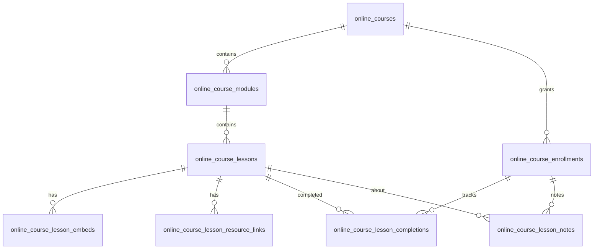

# Kursy online (nagrania: moduły → lekcje)

Dokument opisuje funkcjonalność **kursów online opartych o nagrania wideo** (YouTube / Vimeo / link zewnętrzny), z podziałem na **moduły** i **lekcje**. Dane żyją wyłącznie w bazie **`pneadm`**. Panel administracyjny jest w projekcie **pneadm** (adm.pnedu.pl); nauka i postęp użytkownika są w **pnedu** (pnedu.pl), które łączy się z tą samą bazą przez drugie połączenie Eloquent `pneadm`.

## Adresy (dev / prod)

| Środowisko | Panel admina (treść, dostępy) | Panel uczestnika |
|------------|-------------------------------|------------------|
| Lokalnie | `http://adm.localhost:8083/online-courses` | `http://edu.localhost:8081/dashboard/kursy-online` |
| Produkcja | `https://adm.pnedu.pl/online-courses` | `https://pnedu.pl/dashboard/kursy-online` |

Ścieżka lekcji na pnedu:  
`/dashboard/kursy-online/{id_zapisu}/lekcje/{id_lekcji}` — parametr `{id_zapisu}` to **`online_course_enrollments.id`**, nie ID kursu.

## Relacja z klasycznymi „szkoleniami” (`courses`)

Tabela `courses` (i uczestnictwo w szkoleniach stacjonnych / hybrydowych) to **osobny** byt biznesowy. **Kursy online** to dedykowany zestaw tabel `online_*` — bez mapowania 1:1 na wiersz `courses`, chyba że w przyszłości dodacie taką integrację (pole `legacy_publigo_product_id` w `online_courses` sugeruje migrację z Publigo).

## Model danych (baza `pneadm`)

Migracje (wyłącznie w tym repozytorium, katalog `database/migrations/`):

- `2026_05_11_120000_create_online_courses_structure.php` — rdzeń
- `2026_05_11_200000_create_online_course_lesson_completions_table.php` — ukończenia lekcji
- `2026_05_12_000001_create_online_course_lesson_notes_table.php` — notatki per zapis

### Tabele i znaczenie

| Tabela | Opis |
|--------|------|
| `online_courses` | Kurs: slug (unikalny), tytuł, opisy HTML, `instructor_id`, obrazek, `is_active`, `visible_in_dashboard` (czy pokazać w dashboardzie pnedu), notatki wewnętrzne, soft delete |
| `online_course_modules` | Moduł w kursie: tytuł, `sort_order` |
| `online_course_lessons` | Lekcja: tytuł, `body_html`, `is_published`, `sort_order` |
| `online_course_lesson_embeds` | Wideo: `video_url`, `platform` enum: `youtube` \| `vimeo` \| `other`, opcjonalny tytuł, kolejność |
| `online_course_lesson_resource_links` | Linki / materiały dodatkowe (URL + tytuł) |
| `online_course_enrollments` | Dostęp: `online_course_id` + **znormalizowany e-mail** (unikalny per kurs), imię/nazwisko, `access_expires_at` (UTC, null = bezterminowo), `access_source`, `notes` |
| `online_course_lesson_completions` | Zapis „lekcja ukończona” dla pary (enrollment, lesson) |
| `online_course_lesson_notes` | Notatka tekstowa użytkownika do lekcji (per enrollment) |

### Diagram relacji (uproszczony)

## Panel administracyjny (pneadm)

- **Lista / CRUD kursów:** `OnlineCoursesController`, trasy zasobowe `online-courses` (middleware auth jak reszta panelu).
- **Moduły:** `OnlineCourseModuleController` — dodawanie / edycja / usuwanie; kolejność modułów (drag & drop na stronie edycji kursu): POST `online-courses/{course}/modules/reorder` (`OnlineCoursesController::reorderModules`), body JSON `{ "order": [id_modułu, …] }`.
- **Lekcje:** `OnlineCourseLessonController` — tworzenie z domyślnym `sort_order` = max+1 w module; walidacja tytułu i `body_html`; **embedy i linki** synchronizowane z pól formularza `embeds[]` oraz `resource_links[]` (puste URL są pomijane). Kolejność i przenoszenie między modułami: POST `online-courses/{course}/lessons/reorder`, body JSON `{ "modules": [ { "id": id_modułu, "lesson_ids": [id_lekcji, …] }, … ] }` — kolejność tablicy modułów = kolejność kart na stronie; każda lekcja musi wystąpić dokładnie raz.
- **UI struktury:** `resources/views/online-courses/edit.blade.php` + SortableJS (`partials/structure-sortable.blade.php`) — przeciąganie modułów i lekcji, zapis przez AJAX.
- **Dostępy (zapisy):** `OnlineCourseEnrollmentController` — `updateOrCreate` po parze `(online_course_id, email)`; e-mail normalizowany (`strtolower` + trim); opcjonalna data wygaśnięcia dostępu.

Widoki Blade: `resources/views/online-courses/`.

Obrazy kursów: upload do dysku `public` (`storage/app/public/online-courses/images/…`), ścieżka w kolumnie `online_courses.image` — na pnedu URL buduje `OnlineCourse::publicImageUrl()` z `config('services.pneadm.public_url')`.

## Panel uczestnika (pnedu)

### Konfiguracja

1. **Połączenie MySQL do bazy pneadm** — `config/database.php`, connection `pneadm` (zmienne `DB_PNEADM_*` lub aliasy `DB_ADMPNEDU_*`).
2. **Publiczny URL panelu pneadm** (miniatury z `/storage`): `config/services.php` → `pneadm.public_url` (`PNEADM_PUBLIC_URL` lub domyślnie lokalnie `http://adm.localhost:8083`).

### Modele

Wszystkie modele `App\Models\OnlineCourse*` w pnedu mają `protected $connection = 'pneadm';` — zapytania idą do tej samej bacji co pneadm.

### Trasy (`routes/web.php`, grupa `auth` + `verified`)

| Metoda | Ścieżka | Kontroler |
|--------|---------|-----------|
| GET | `/dashboard/kursy-online` | `DashboardOnlineCoursesController@index` |
| GET | `/dashboard/kursy-online/{enrollment}` | `show` — jeśli są opublikowane lekcje, redirect do pierwszej |
| GET | `/dashboard/kursy-online/{enrollment}/lekcje/{lesson}` | `lesson` — widok nauki |
| POST | `…/lekcje/{lesson}/ukonczenie` | `toggleLessonCompletion` (throttle 120/min), obsługa JSON |
| POST | `…/lekcje/{lesson}/notatka` | `saveLessonNote` (throttle 60/min), obsługa JSON |

### Reguły dostępu (`DashboardOnlineCoursesController`)

- Lista zapisów: wiersze `online_course_enrollments` gdzie `email` = znormalizowany e-mail zalogowanego użytkownika **oraz** kurs ma `is_active` i `visible_in_dashboard`.
- Każda akcja: `assertEnrollmentAccess` — zgodność e-maila + brak wygaśnięcia (`hasExpiredAccess()` porównuje `access_expires_at` w UTC z „teraz” UTC).
- Lekcja: musi należeć do kursu zapisu, `is_published === true`.

### UI lekcji

- `resources/views/dashboard/online-courses/lesson.blade.php` — sidebar z modułami/lekcjami, iframe YouTube/Vimeo (`OnlineCourseLessonEmbed::getEmbedUrl`), treść HTML, linki, postęp, notatki (AJAX + opcjonalnie formularz klasyczny).
- Link w menu: `resources/views/dashboard/partials/sidebar-nav.blade.php` → „Kursy online”.

## Typowy flow wdrożeniowy na nowym laptopie

1. Uruchomić Docker / Sail dla **obu** projektów (wspólna sieć lub ten sam host MySQL z dwiema bazami: `pnedu` + `pneadm`).
2. W **pneadm**: `sail artisan migrate` — utworzenie tabel `online_*` w bazie pneadm.
3. W **pnedu**: upewnić się, że `.env` wskazuje tę samą instancję MySQL i bazę `pneadm` w sekcji `DB_PNEADM_*`; ustawić `PNEADM_PUBLIC_URL` jeśli adres panelu inny niż domyślny.
4. W panelu pneadm: utworzyć kurs → moduły → lekcje (embedy) → opublikować lekcje → dodać enrollment na **ten sam e-mail**, który ma konto na pnedu.
5. Zalogować się na pnedu: **Kursy online** → wejście w kurs przekierowuje do pierwszej opublikowanej lekcji.

## Indeks plików (szybkie odniesienie)

**pneadm**

- Migracje: `database/migrations/2026_05_11_*`, `2026_05_12_*`
- Modele: `app/Models/OnlineCourse*.php`
- Kontrolery: `app/Http/Controllers/OnlineCoursesController.php`, `OnlineCourseModuleController.php`, `OnlineCourseLessonController.php`, `OnlineCourseEnrollmentController.php`
- Trasy: `routes/web.php` (grupa `online-courses`…)
- Widoki: `resources/views/online-courses/`

**pnedu**

- Modele: `app/Models/OnlineCourse*.php` (connection `pneadm`)
- Kontroler: `app/Http/Controllers/DashboardOnlineCoursesController.php`
- Widoki: `resources/views/dashboard/online-courses/`
- Konfiguracja: `config/database.php` (`pneadm`), `config/services.php` (`pneadm.public_url`)

## Rozszerzenia na później (niezaimplementowane w kodzie bazowym)

- Automatyczne zapisy po zakupie / formularzu (obecnie enrollment ręczny lub zewnętrzny import przez `access_source`).
- Publiczna strona ofertowa kursu online po `slug` (obecnie nacisk na dashboard po zapisie).
- Synchronizacja z tabelą `users` po `user_id` zamiast dopasowania po e-mailu — wymagałaby zmiany schematu.

---

*Ostatnia synchronizacja opisu z kodem: maj 2026.*
